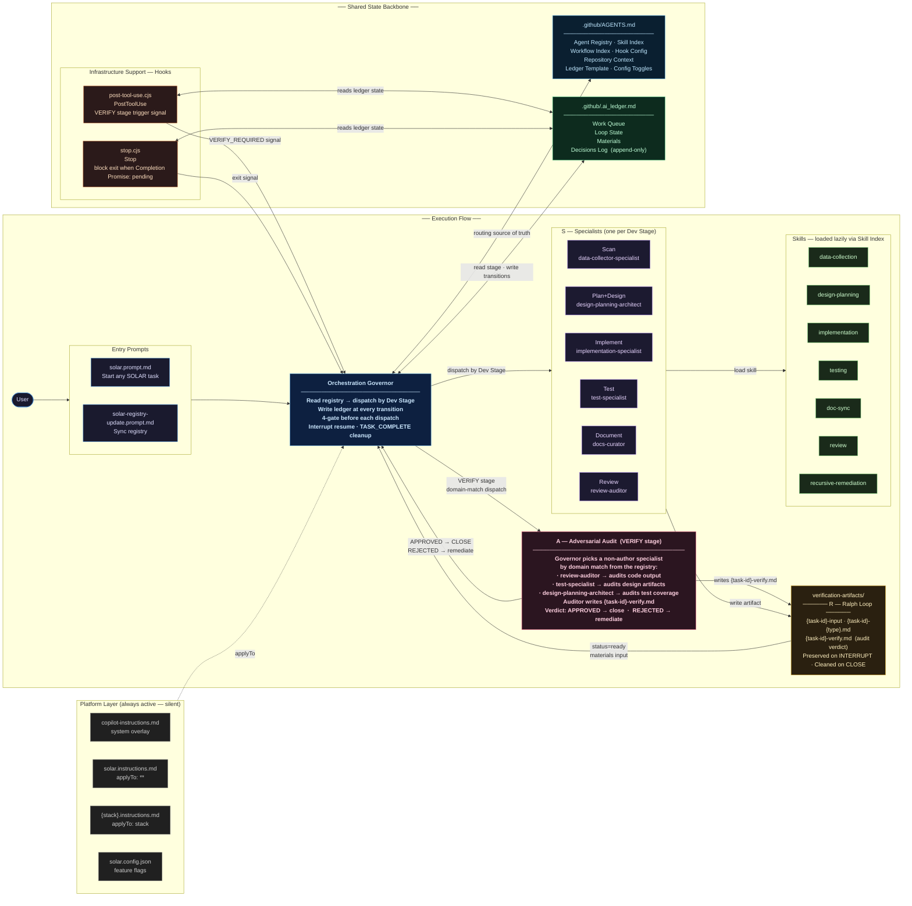

# SOLAR-Ralph — Component & Layer Relational Diagram

> Post-install map of all installed files, how they relate, and which SOLAR layer each belongs to.
> **S** = Specialist · **O** = Orchestrator · **L** = Ledger · **A** = Adversarial audit (Governor dispatch rule) · **R** = Ralph Loop
>
> Layout: left column = execution flow (top-to-bottom); right column = shared state backbone.
> Hooks are **infrastructure support** — they share gate-enforcement workload with the Governor. They are not the adversarial layer.

---

## Layer Legend

| Layer                          | Color       | Description                                                                                                                                                         |
| ------------------------------ | ----------- | ------------------------------------------------------------------------------------------------------------------------------------------------------------------- |
| **Entry**                      | Blue        | `prompts/solar.prompt.md`, `solar-registry-update.prompt.md`                                                                                                        |
| **Platform** (always active)   | Dark gray   | `copilot-instructions.md`, `solar.instructions.md`, `{stack}.instructions.md`, `solar.config.json`                                                                  |
| **O — Orchestrator**           | Cyan        | `agents/orchestration-governor.agent.md` · `AGENTS.md` (registry + config)                                                                                          |
| **L — Ledger**                 | Green       | `.ai_ledger.md` — Work Queue, Loop State, Materials, Decisions Log                                                                                                  |
| **A — Adversarial Audit**      | Pink        | No dedicated file. Governor dispatch rule: at VERIFY stage, picks a domain-matched non-author specialist from the registry to challenge the previous agent's output |
| **Infrastructure — Hooks**     | Orange      | `hooks/post-tool-use.cjs`, `stop.cjs` — signal emitters; share gate-enforcement workload with the Governor; not the adversarial layer                               |
| **S — Specialists**            | Purple      | 6 `*.agent.md` files (one per dev stage)                                                                                                                            |
| **Skills**                     | Light green | 7 `SKILL.md` files (loaded lazily at task time via Skill Index)                                                                                                     |
| **R — Ralph Loop / Artifacts** | Amber       | `verification-artifacts/` — all stage outputs + audit verdicts                                                                                                      |

## Key Data Flows

| Flow                                            | Direction         | Description                                                                                                       |
| ----------------------------------------------- | ----------------- | ----------------------------------------------------------------------------------------------------------------- |
| `solar.prompt.md` → Governor                    | invoke            | User starts a task; Governor takes over                                                                           |
| Governor ↔ `AGENTS.md`                          | read              | Single routing source of truth; Dev Stage + Loads Skill columns                                                   |
| Governor ↔ `.ai_ledger.md`                      | read + write      | Stage transitions, materials tracking, Decisions Log                                                              |
| Governor → Specialist                           | dispatch          | By matching Dev Stage column in Agent Registry                                                                    |
| Specialist → Skill                              | loads             | Reads Skill Index in AGENTS.md; loads SKILL.md before acting                                                      |
| Specialist → `verification-artifacts/`          | writes            | Every stage produces a `{task-id}-{type}.md` artifact                                                             |
| `verification-artifacts/` → Governor            | materials input   | Governor checks status=ready before next dispatch (G1 gate)                                                       |
| Governor → VERIFY dispatch                      | adversarial audit | Governor selects a non-author specialist by domain match; specialist acts as auditor for this stage only          |
| Auditor → `verification-artifacts/`             | writes verdict    | Produces `{task-id}-verify.md` (APPROVED or REJECTED + reasoning)                                                 |
| Auditor → Governor                              | verdict           | APPROVED → append to Decisions Log → CLOSE; REJECTED → return to producing agent for remediation                  |
| Hooks → Governor                                | gate signals      | `ADVERSARIAL_VERIFY_REQUIRED` (post-tool-use on VERIFY stage), exit decision (stop) — infrastructure signals only |
| Hooks ↔ `.ai_ledger.md`                         | reads             | Gate checks read ledger state (loop bounds, stage, materials, Decisions Log)                                      |
| `solar-registry-update.prompt.md` → `AGENTS.md` | syncs             | After any component add/swap/remove                                                                               |

## Optional Components (not shown — add via `solar-registry-update`)

- `release-readiness-specialist.agent.md` + `release-governance` skill — Release stage gate
- Learning system, session logging, stack-specific specialists
