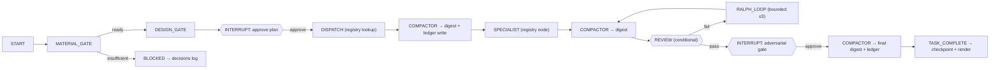

# SOLAR-Ralph v5 — System State (governor-as-graph)

> **Version note (2026-09-05):** this doc is the **v5.3 track** — governor-as-graph (LangGraph). The v5 line folds three threads: **v5.1** context-efficiency (shipped) · **v5.2** agent-consistency enforcement via platform primitives (see `docs/research/v5-agent-consistency-*.md`, `docs/work-logs/v5.2-consistency-implementation-plan.md`) · **v5.3** governor-as-graph (this doc). Sub-versions = clean commit buckets.
> **Status:** RELEASED — v5.7.1 (2026-09-19). v5.4.0 gave the **HTTP runner full role capacity
> without a shell**: `read_file` line ranges; a write deny-list plus per-role
> `write`/`write_scope`/`write_deny`; `tools` finally gates the offered tool set; a
> repo-declared command vocabulary (`.solar/commands.json` — fixed argv, no free-text
> field) with per-role `exec_allow`; a **tool-enforced** approval gate for acting
> commands; and checkers as first-class shaped tools. Also absorbs **TD-5.4-1**: each
> role's registry `model` is now resolved. Runtime (`solar-governor/`) carries all of it;
> mandarin pilot (`solar-v5-wire`, reference only) T1–T5 PASS + epic-25 Phase A
> delivered + driver-orchestrated verify close-out APPROVED; eval battery 18/18.
> Chaining is driver-orchestrated (the self-chain entry dispatch was removed in v5.3.1).
> Full epic-25 with the detailed pipeline = still next, on `main` after installing the
> runtime.
>
> **v5.4.1 (2026-09-18)** closes the defect that v5.4.0's own verification exposed: the
> specialist tool loop had **no termination rule at all**. On a real read-only role it
> returned no answer in **4 runs out of 5** — over a one-file, one-fact objective — and a
> failed run spent ~170k prompt tokens before giving up. See §20.
>
> **v5.4.2 (2026-09-18)** makes the runner choosable for a single run (`run --runner X`),
> so a repo pinned to `agent-dispatch` can be exercised through `http` without editing its
> config — and `SOLAR_RUNNER`, until now dead behind that config, finally wins. An
> unrecognised runner is now an error rather than a silent fallback to auto.
>
> **v5.5.0 (2026-09-18)** closes the v5.4.x backlog: `doctor` names the model that will
> actually run and warns on an id the provider does not serve; `eval` resolves cases per
> repo and says so when its battery does not apply; `uplink` is implemented (opt-in,
> push-only, never in the critical path); `reasoning_effort` pass-through; and a
> `REJECTED` run exits 12 rather than 0. See §21.
>
> **v5.6.0 (2026-09-19)** makes an install portable and re-runnable: `config.json` no
> longer stores an absolute path anywhere, `init` merges instead of clobbering, a
> marker-delimited `.gitignore` block replaces per-repo prose, `.solar/VERSION` records
> what the repo was installed against, and repos can declare a model **tier** so a provider
> rename is one edit. See §22.
>
> **v5.6.1 (2026-09-19)** fixes this file's own claim: the ledger said it was "the run
> record" while `render` replaced it wholesale on every run, and it destroyed a 115-line
> hand-written brief in a real engagement. `ledger.record` appends one section per run and
> never rewrites anything it did not write. See §23.
> **Release:** v5.6.1 (2026-09-19)
> **Preceded by:** v4 (see [v4.md](v4.md))
> **Theme:** Governor-as-graph — LangGraph is the **control layer**, MCP is the **tool layer**, the host repo is the **data/context layer**. Same SOLAR pillars, real control flow.

---

## 1. What Changed from v4 (summary)

| Area          | v4.6 (textual control)                   | v5 (governor-as-graph)                                                      |
| :------------ | :--------------------------------------- | :-------------------------------------------------------------------------- |
| Runtime       | VS Code + Copilot only (prompts + hooks) | Own Python process (LangGraph); VS Code = one client of many                |
| Control       | prompt-instructed state machine          | graph nodes + conditional edges (deterministic routing)                     |
| State         | `.ai_ledger.md` (3 real sections)        | SQLite checkpoint + rendered human-view ledger                              |
| Adversarial   | post-tool-use hook + Review Auditor      | write-guard in workspace MCP server + adversarial VERIFY node (interrupt)   |
| Specialists   | `.agent.md` files (stateless subagents)  | `SPECIALISTS` registry → in-graph LLM nodes (+ optional write adapter)      |
| Compaction    | Context Summarizer subagent per dispatch | **compactor** first-class node (digest + ledger write)                      |
| Profiles      | 5 config toggles only                    | **light / full** named graph configurations over one runtime                |
| Install       | `solar-install.prompt.md` (~30 files)    | one engine, 4 fronts: `uvx`/`npx solar-governor init`, container, CI action |
| Verifiability | manual                                   | install `doctor` + operational eval (rolling L3 metrics)                    |
| Sovereignty   | n/a (local only)                         | repo-bounded by default; hub uplink = opt-in, owned repos only              |

## 2. Architecture — three layers

```
┌─ Surface (any client): VS Code (.mcp.json) · CLI `solar run` · HTTP/SSE · later Slack/WhatsApp
├─ CONTROL LAYER — LangGraph governor graph (own process)
│     gates · routing · interrupts · checkpoint · compactor · profiles
├─ TOOL LAYER — MCP servers (local, repo-scoped)
│     workspace (read/edit + write-guard) · exec · repo-index · [kb uplink = owned repos only]
└─ DATA/CONTEXT LAYER — repo-local truth
      .solar/state (checkpoint) · .ai_ledger.md (human view) · learnings · artifacts
      [optional hub uplink: digests/decisions/learnings → hub events.db — owned repos only]
```

**Guardrail:** MCP = tool protocol · LangGraph = control flow · repo = durable truth. Never rebuild the vector DB or MCP runtime inside the graph.

## 3. Governor (graph)

| Property      | Value                                                         |
| :------------ | :------------------------------------------------------------ |
| Runtime       | Python 3.12 process (own; no IDE required)                    |
| Engine        | LangGraph 1.x (pinned)                                        |
| State schema  | §4                                                            |
| Checkpointer  | SQLite (`langgraph-checkpoint-sqlite`) — durable restart-safe |
| Human-in-loop | `interrupt()` → approve/deny over any channel (stdin / HTTP)  |
| Observability | traces (`get_state_history`) + repo-local events              |
| Entry points  | CLI `solar run "<task>"` · MCP server · HTTP/SSE (later, R9)  |
| Model routing | per-node `model` config (env) — cheap→fast, deep→strong       |

## 4. State schema

Grounded on the **real** v4 ledger (3 sections). ⚠️ **Drift note:** README + v4.md claim a 5-section ledger (`Loop State`, `Materials`); the actual installed template has **3** (Objective / Work Queue / Decisions Log). v5 does not inherit the phantom sections — anything v5 needs becomes an explicit state channel.

```python
class SolarState(TypedDict):
    # --- ledger-sourced (rendered to .ai_ledger.md) ---
    objective: str
    work_queue: list[TaskRow]      # id, task, agent/role, status, stage, iteration
    decisions_log: list[str]       # append-only, UTC timestamps
    # --- graph runtime ---
    thread_id: str
    stage: str                     # current node
    intent: str                    # routed intent
    materials_status: str          # READY / INSUFFICIENT
    design_status: str             # PENDING / APPROVED / REJECTED
    digests: list[Digest]          # compactor output per stage
    verdict: str                   # APPROVED / REJECTED
    result: str
```

`TaskRow` / `Digest` are the only structured additions; the ledger render is derived from this state (checkpoint = source, ledger = render).

## 5. Node map



| Node               | Purpose                                                                                          |
| :----------------- | :----------------------------------------------------------------------------------------------- |
| MATERIAL_GATE (G1) | materials-status READY? else emit `MATERIAL_INSUFFICIENT`, pause                                 |
| DESIGN_GATE (G2)   | plan approved? `interrupt()` if `human_approval` / full profile                                  |
| DISPATCH           | registry lookup by intent → next specialist (deterministic, no bypass)                           |
| COMPACTOR          | collapse raw/intermediate + decisions → digest; append ledger                                    |
| SPECIALIST         | in-graph LLM node from registry (or a-dispatch adapter for deep writes)                          |
| REVIEW (G4)        | conditional edge: pass → adversarial / fail → Ralph loop (G3 bound)                              |
| RALPH_LOOP         | bounded re-entry (iteration ≤3)                                                                  |
| ADVERSARIAL        | `interrupt()`: non-author auditor verdict → approve/deny                                         |
| PREMISE_GATE       | debate: verify the user's premise vs ground truth before executing; mismatch → interrupt (§18.3) |
| GUIDED_HANDOFF     | hand-guide: user delivers part themselves with guide + checkpoints (§18.4)                       |
| TASK_COMPLETE      | checkpoint reset + ledger re-render (automatic)                                                  |

## 6. Specialist registry

`SPECIALISTS` = `{ role: { system, tools, next_edges, model, write?, write_scope?, write_deny?, exec_allow? } }` — the graph equivalent of `AGENTS.md` §3. Everything from `write?` on is optional and **enforced by the tool layer, not the prompt** (v5.4.0):

| Key           | Meaning                                                                                                                                                                                                 |
| :------------ | :------------------------------------------------------------------------------------------------------------------------------------------------------------------------------------------------------ |
| `tools`       | tool GROUPS the role may use. **Now actually read** — without `workspace` the file tools are not offered, without `exec` `run_command` is not. Absent/empty = `["workspace"]` (the historical default). |
| `write`       | `false` = read-only: `write_file` is neither offered nor permitted. Defaults to `true`, so existing registries are unchanged.                                                                           |
| `write_scope` | if set, writes MUST fall under one of these repo-relative prefixes.                                                                                                                                     |
| `write_deny`  | extra prefixes this role may not write. Additive only — it can never re-open the unconditional deny-list.                                                                                               |
| `exec_allow`  | names from `.solar/commands.json` this role may run. Defaults to NOTHING: exec is opt-in.                                                                                                               |

**Why the tool layer and not the prompt:** the running model overrides prose constraints, including explicit ones (measured **0/8** on a read-only instruction, and `you MUST` ignored **8/8**). Capability is the containment — a tool that is never offered cannot be argued into use. The **unconditional** write deny-list is `.solar/`, `.git/`, `.github/`, `.vscode/` plus agent/CI-defining files (`package.json`, `pyproject.toml`, `Dockerfile`, `.mcp.json`, …), matched case-insensitively on any path segment at any depth.

- **Swap** a specialist = edit one registry entry (data, not a file + installer).
- **Playbook** = a named edge sequence over the registry (v4 §5 Playbook Index becomes a routing config).
- v4's "specialists are stateless, digest-fed" invariant is preserved by the compactor (channel isolation).
- **a-optional write adapter:** deep code-writing tasks may dispatch the existing `.agent.md` subagents via an MCP agent-dispatch tool (preserves hook-guarded writes); lightweight steps stay in-graph.
- **Role spec adds behavior (§18.3/18.4):** each specialist's spec carries (a) **premise-verify** — challenge the user's framing against ground truth (repo/spec) before executing; (b) **hand-guide detection** — recognize when the user should deliver part themselves and route to GUIDED_HANDOFF.

## 7. Compactor (first-class node)

- Inputs: raw session/intermediate output, `user redirect` changes, decisions log entries.
- Outputs: compact `digest` (the ONLY state the next specialist receives) + ledger append (surfaced memory).
- Token-cost control: digest target ≤ ~40% of raw (measured in EVAL 6).
- Makes v4's manual "context roll-up after 3 dispatches" obsolete.

## 8. Profiles — light / full

Named graph configurations over ONE registry + ONE runtime (the 5 `solar.config.json` toggles become profile knobs).

| Dimension           | 🪶 Light (fast-moving repos, e.g. mandarin) | 🛡 Full (spec-driven)                |
| :------------------ | :------------------------------------------ | :----------------------------------- |
| Nodes               | `dispatch → review → done` (4–5 nodes)      | full map (§5)                        |
| Gates               | none (or design-only)                       | G1–G4 enforced                       |
| Adversarial         | off (or fast single-pass)                   | domain-matched auditor               |
| Human approval      | off / on-demand                             | on (design + adversarial interrupts) |
| Ledger              | checkpoint only                             | full + human view                    |
| Compactor           | off                                         | mandatory                            |
| Hooks / write-guard | deny-list floor + role policy (§6)          | workspace MCP guard                  |
| Model               | single fast model, per-role `model` if set  | tier/model per node                  |

**Deep trade (see §13.15):** light sacrifices independent verification, design gate, effort steering, restart ceremony — for speed, low tokens, no interrupt friction. What always survives: the parts that encode _judgement_ (design approval, adversarial, project playbook gates).

## 9. Install & cloud-ready (one engine, 4 fronts)

| Front      | Command / artifact                                                                                                                        | Notes                                                                        |
| :--------- | :---------------------------------------------------------------------------------------------------------------------------------------- | :--------------------------------------------------------------------------- |
| Engine CLI | `pip install ./solar-governor` · `solar-governor init --profile light\|full` · `solar-governor run "<task>"` · `serve` / `bench` / `eval` | **shipped** — writes `.solar/config.json` + `registry.json` (Python package) |
| npm shim   | `npx solar-governor init` (planned)                                                                                                       | thin wrapper for JS/TS repos                                                 |
| Container  | `ghcr.io/solar-ralph/governor` (planned)                                                                                                  | headless cloud runs; state → volume/GCS/S3                                   |
| CI action  | `solar-ralph/governor-action` (planned)                                                                                                   | install + run in CI, zero local setup                                        |

**Cloud-ready (planned):** headless (`solar run` in bare terminal/CI/container) · non-interactive (`--ci`/`--yes`, env `SOLAR_PROFILE`, `SOLAR_APPROVAL=off`) · durable state (volume/object store) · remote later (HTTP/SSE gateway). Shipped today: the CLI + `serve` HTTP API on a local repo.

## 10. Verifiability — install + operation

- **Install (`init --verify` / `solar-governor doctor`):** graph compiles · registry loads · MCP servers connect (workspace/exec/repo-index) · checkpoint SQLite writable · model endpoints reachable · uplink config valid · **smoke task runs end-to-end on THIS repo** (material gate → dispatch → review → TASK_COMPLETE). Output = JSON health report (PASS/WARN/FAIL); non-interactive in CI.
- **Operational:** per-run telemetry (checkpoint written, ledger rendered, traces) → repo-local events · rolling eval metrics (completion %, first-pass APPROVED %, rework count, tokens/task) · periodic `doctor` (MCP alive, checkpointer durable, model fallback) · read-only guard denies writes outside the repo **and to a protected in-repo set** (§6). An **acting** command (`kind: act`) does not run at all when `human_approval` is set — it writes `.solar/approvals/<id>.md` and stops, so the model cannot proceed until a human writes `allow` or `deny: <reason>` (§6/Part D). `kind: check` output is **shaped**: a passing check collapses to one line, a failing one keeps its failures plus the final summary and states how many lines it suppressed.
- **`doctor` today (v5.5.0)** implements a subset, stated plainly rather than implied: config loads · checkpoint writable · graph compiles · registry + chains load · runner resolves (an unknown value is a **FAIL**, not a silent auto) · **model resolution** reports the id _and its source_, names roles that override it, and asks the provider's `/models` — **WARN** when the id is neither served nor a known unlisted alias · **uplink config validity** (no network). WARN is a real third state: only FAIL exits non-zero. Not yet checked: MCP servers, the end-to-end smoke task, model _reachability_ beyond the id list.

## 11. Data sovereignty

1. **Local-first, always** — checkpoint `.solar/state/`, ledger, learnings, artifacts all in the host repo.
2. **Hub = optional uplink, opt-in** — `uplink: none | hub:<url>`, default `none`; only repos we own set it; repo stays source of truth, hub is pure consumer. **Implemented in v5.5.0** (`uplink.py`): push-only by construction — the module contains no download path — and `push()` never raises, so a hub cannot fail or block a run (§21).
3. **Graceful degradation** — no hub → KB node skipped, graph still completes.
4. **Hub reach = workspace mount access only** (structural, not just policy).
5. The harness is **fully functional standalone** on any repo (incl. third-party); it never depends on the hub.

## 12. What stays / what changes

**Stays (public API preserved):** `solar-install.prompt.md` (as glue/fallback) · `solar.config.json` (flags → profile) · `AGENTS.md` (registry source → `SPECIALISTS`) · `#solar.prompt.md` (zero-runtime fallback) · `solar.instructions.md` (communication discipline) · `post-tool-use` write-guard (→ workspace MCP server).

**Changes:** `.ai_ledger.md` → checkpoint + human view · `verification-artifacts/` tree → one verdict + traces · `effort_preamble_lookup` (TD-4-\*) → model routing · `stop` hook → terminal node · Context Summarizer subagent → compactor node · `solar-registry-update` prompt → registry data edits.

## 13. v4→v5 migration

1. Install the governor runtime (`pip install ./solar-governor`, then `solar-governor init --profile <light|full>`).
2. Migrate `AGENTS.md` §3 registry → `SPECIALISTS` registry (mechanized).
3. Migrate ledger → checkpoint + human-view renderer (state schema §4).
4. Migrate G1–G4 gates → graph nodes (§5).
5. Migrate write-guard hook → workspace MCP server (server-side policy).
6. Keep `#solar.prompt.md` as the zero-runtime fallback.
7. Validate: install `doctor` + golden-task run (§13.10 L3).
8. **Parallel-run** v4 harness + v5 graph on the same task suite → compare (completion %, first-pass APPROVED %, rework, tokens/task). Evidence feeds the B2 decision gate.

## 14. IDE-agnostic

L0: `.agent.md`/askQuestions → registry nodes + non-IDE interrupt channel. L1: tools behind MCP (workspace/exec/repo-index). L2: per-node model config (env). L3: same graph from any surface (VS Code `.mcp.json`, CLI, HTTP/SSE). What stays VS Code-bound: the diff/approve write UX — VS Code becomes one client of many; Copilot becomes one model/tool backend.

## 15. Known decisions / open questions

1. **Specialist-node shape:** b-primary (registry + compactor + conditional routing) + a-optional write adapter — validated in B2 EVAL 5/6.
2. **Checkpointer:** SQLite required (MemorySaver would regress restart-safety).
3. **Compactor threshold:** digest ≤ ~40% raw (measure in EVAL 6).
4. **Profiles:** `light` / `full` initial; `balanced` optional.
5. **Uplink:** default `none`; owned satellites opt in per repo.
6. **Observability:** LangSmith vs `get_state_history` + local events (defer).
7. **Behavior defaults (v5.md §18):** PREMISE_GATE on/off per profile, hand-guide routing signals, capture-layer toggles — validate during the mandarin pilot (B3).

## 16. Reference / grounding

- Hub plan: `_wip/master-repo-restructure.md` §13.9 (feasibility), §13.10 (test/eval), §13.11 (IDE-agnostic), §13.12 (install), §13.13–13.15 (profiles + deep trade)
- Prototype + 6 evals: `experiments/governor-graph/` (B2)
- v4 internals + drift findings: `docs/versions/v4.md`, `template/.github/AGENTS.md`, `template/.github/prompts/solar.prompt.md`, `TODOs.md`

## 17. Decision — B2 gate (2026-08-31)

**Evidence — all 6 evals PASS (`experiments/governor-graph/eval.md`):**

| Eval                         | Result                                                    |
| ---------------------------- | --------------------------------------------------------- |
| EVAL 3 deterministic routing | 20/20 stable routes (kills TD-4-1 bypass)                 |
| EVAL 1 HITL interrupt        | approve→complete, deny→rework→re-pause→complete           |
| EVAL 2 SQLite checkpoint     | resume after session loss in a NEW process                |
| EVAL 4 streaming             | node outputs incremental, SSE-framed (R9 gateway)         |
| EVAL 6 compactor             | 120→44 tokens (37%); consumer sees only digest            |
| EVAL 5 hub KB MCP            | node→hub tool call + graceful degradation when hub absent |

**Verdict: ✅ ADOPT v5 on graph — proceed to full migration.**

- **Master-structure test passed:** MCP (tool layer) + hub (data layer) from Part A host a LangGraph control layer.
- **Timeline (actual):** (a) runtime shipped — registry + light/full profiles + CLI/HTTP (`pip install ./solar-governor`); (b) **pilot: v5 LIGHT on mandarin** (`solar-v5-wire`, reference only) — T1–T5 PASS + epic-25 Phase A + verify close-out APPROVED; self-chain falsified → driver-orchestrated (v5.3.1); (c) **v5.4.0** — HTTP runner capacity without a shell (Parts A–E: line ranges, write policy, command vocabulary, approval gate, shaped checkers) + per-node model routing (TD-5.4-1); (c2) **v5.4.1** — tool-loop termination (explicit temperature, budget notice, tool-less final round); **v5.4.2** — per-run runner override (`run --runner X`; `SOLAR_RUNNER` now beats the config); **v5.5.0** — the operator's surface: doctor model resolution + provider check, per-repo eval cases, `uplink`, `reasoning_effort` pass-through, `REJECTED` exits 12 (TD-5.4-2/4/5/6/7/10); **v5.6.0** — install consistency: portable config, merging `init`, version marker, generated ignore block, model tiers (TD-5.6-1/2); **v5.6.1** — the ledger appends instead of overwriting (TD-5.6-5); (d) **next:** install the runtime on mandarin `main` and run the real epic-25 with the full pipeline; (e) later: hub router-as-graph (R9) + remaining fronts (npm/container/CI, SSE).
- **Carried guardrails (feasibility §13.9.2):** specialist shape **b-primary / a-optional**; SQLite checkpoint mandatory; compactor ~40% token target; sovereignty repo-bounded, hub uplink opt-in (§13.14).
- **Follow-on (post-migration):** adopt v5 to run ON the master repo itself.

## 18. Behavior principles + capture model (2026-09-04)

Design notes from the master-repo review + pre-pilot considerations.

### 18.1 Concerns already solved by design (instruction drift + orchestrator scope)

- **Instruction drift ("lost in the middle"):** the orchestrator is CODE (nodes/edges), not a long-lived prompt model — there is no governor system prompt to forget. Specialist LLM nodes get a fresh, short system prompt + only the compactor digest → drift is bounded per-node, never accumulated globally.
- **Orchestrator reasoning outside scope:** routing = conditional edges (pure functions); the only judgment gates are human interrupts. The "LLM orchestrator makes calls it shouldn't" failure is removed by construction.

### 18.2 Explore/debug mode (non-spec work)

- Debugging/exploratory work is **agent-mode**, not workflow. Add an **EXPLORE/debug subgraph** (LLM-directed, loose gates) reachable from routing when intent = debug/explore/investigate.
- Spec work → workflow path (deterministic); debugging → explore path (flexible). Bounces between them are cheap graph edges (~0 tokens) → "more bounce → more drift" does not recur.
- Profile note: light defaults toward explore; full keeps a **spec-lock** requiring an explicit human override to leave the spec path.

### 18.3 Debate gate — verify the user's premise before obeying

- **Principle:** the specialist's first instinct is to VERIFY against the user's actual input + ground truth (repo/spec/reality). Most AI-agent failures come from trusting/over-obeying a wrong or ambiguous user framing.
- **Node:** PREMISE_GATE — parse the request into premises; check each against retrievable ground truth (codebase search, docs, state via MCP tools); if a premise fails/ambiguous → `interrupt()` with a **debate** (present the discrepancy, let the human resolve direction) BEFORE any work.
- Full profile: PREMISE_GATE always on (interrupt on mismatch). Light profile: quick premise check; skip on explicit "just do X."
- Personality fit: Cd (Skeptic) — argues with the request before committing; evidence over compliance.

### 18.4 Hand-guide mode — the user may need to deliver part of the task

- **Principle:** the harness is self-aware that some tasks are best done BY the human: learning a new stack, building intuition/ownership, judgment only the user can make, or steps only they have access to. **Anti-vibe-coding:** equip the user to do it with understanding rather than always doing it for them.
- **Node:** GUIDED_HANDOFF. Routing detects intent signals ("teach me / how do I / should I / I'll write it", new-stack user needing confidence, dev wanting hands-on) → subgraph that produces: decision rationale, step-by-step guide, verification checkpoints; leaves execution to the user (optionally AI reviews afterward).
- Serves two users: (a) unsure about a new stack → needs to be sure decisions are right (guide + verify); (b) a dev who must write code to truly understand it → guide, don't replace.
- Wiring: intent detection in classify/route; role spec gains hand-guide-vs-do-it; profiles toggle how eager the graph is to hand off.

### 18.5 Four-layer capture model — what the graph records

| Layer          | Captures                                       | Source                     | Feeds                                   |
| -------------- | ---------------------------------------------- | -------------------------- | --------------------------------------- |
| **Checkpoint** | full state per super-step                      | SQLite                     | replay / resume / audit                 |
| **Trace**      | raw process (prompts, outputs, tool calls)     | LangSmith / OpenAI tracing | failure analysis, self-improve (opt-in) |
| **Run-card**   | structured metrics (tokens, duration, verdict) | per-run JSON (§14.7.3)     | evaluation                              |
| **Digest**     | compacted memory/decisions                     | compactor → ledger / hub   | self-improve, contribute to master      |

- State IS fully captured (checkpoint). Raw model reasoning lives in **trace** (selective, not auto-logged — secrets + cost).
- Sovereignty (§13.14): only owned repos uplink, and only the curated record (digest/decisions/run-cards), never raw transcripts.
- The hub already has the sinks: `data/events.db` + `/remember` + repo index → v5 nodes write into them when connected (owned-repo uplink).

## 19. Concept alignment — canonical concept → v5.3 graph (2026-09-05)

The governor-as-graph is the **formalization** of the canonical concept (`docs/solar-ralph-concept.md`): the concept's "pure event-driven orchestrator that reads the ledger and fires nodes" was a hand-written state machine — v5.3 makes it code (LangGraph). All 8 concept invariants survive:

| #   | Concept invariant                                         | v5.3 graph equivalent                                                   |
| --- | --------------------------------------------------------- | ----------------------------------------------------------------------- |
| 1   | Orchestrator never forks; runs inline; owns all gates     | the graph (code) owns all gate nodes                                    |
| 2   | Specialists never communicate directly                    | nodes communicate only via **state channels** + compactor digest        |
| 3   | Adversarial = non-author, domain-matched                  | review/adversarial nodes (non-author, role-matched)                     |
| 4   | Ralph loop needs declared exit criteria                   | bounded rework ≤3 + explicit exit edges                                 |
| 5   | `TASK_COMPLETE` gated by adversarial                      | review gate → complete                                                  |
| 6   | Ledger is sparse (Objective / Work Queue / Decisions Log) | matches the real 3-section ledger; checkpoint = source, ledger = render |
| 7   | Material gate before every dispatch                       | `material_gate` node                                                    |
| 8   | `BLOCKED:` appended to Decisions Log                      | BLOCKED edge → decisions_log                                            |

**Mechanism shifts (invariants preserved, medium changed):**

- Orchestrator: prompt-instructed agent → **deterministic graph** (no drift, no scope creep).
- Handoff: `verification-artifacts/` files → **state channels + compactor digest** (compactor = context-summarizer + artifact writer merged).
- Context: Context-Summarizer subagent per dispatch → **compactor node** (channel isolation).
- Tools: IDE tools + `.cjs` hooks → **MCP servers** (provider-agnostic).
- `.github/` (template/): kept as the v4/v5.x agent-harness form, used for IDE-native Copilot subagent dispatch (shape-a write adapter).

## 20. Tool-loop termination — the executor's stop rule (2026-09-18)

Verifying v5.4.0 ran one read-only link (`investigator`) against a real clone through the
`http` runner. The tool grants were correct — the role was offered exactly `list_tree` /
`read_file` / `glob`, with no `write_file` and no `run_command` — and the loop **still
returned no answer at all**, in 4 runs out of 5.

### What was measured

| Run    | Model            | Cap | Objective                          | Result                                      |
| :----- | :--------------- | :-- | :--------------------------------- | :------------------------------------------ |
| a-inv2 | `deepseek-chat`  | 12  | 3-part investigation               | 23 calls, 107k in → `max_rounds`, no answer |
| a-inv3 | `deepseek-chat`  | 24  | same objective                     | 46 calls, 521k in → `max_rounds`, no answer |
| a-inv4 | `deepseek-flash` | 12  | same objective                     | 23 calls, 152k in → `max_rounds`, no answer |
| a-inv5 | `deepseek-flash` | 12  | one file, one fact, "Nothing else" | 21 calls, 168k in → `max_rounds`, no answer |
| a-inv6 | `deepseek-flash` | 12  | **identical to a-inv5**            | 5 calls, 19k in → **answered, APPROVED**    |

Read the last pair again: **a-inv5 and a-inv6 are the same command.** Same repo, role,
prompt, objective, model and cap — one failed, one converged. Two causes, and neither was
the round cap or the model:

1. **No termination pressure.** The loop was `for _ in range(max_rounds): call; if
tool_calls: continue`. Nothing told the model it was running out, and `msg.content` was
   **discarded** whenever a tool call was present — so a model that kept finding one more
   file to read spent every round and returned nothing.
2. **No sampling control.** The loop never sent `temperature`, inheriting the provider
   default (~1.0), which made tool-use convergence non-deterministic on identical input.

This also **corrects `docs/tuning.md` finding 3**, which concluded that "the decisive lever
on heavy tasks is the _objective_ ('be efficient, batch reads, stop once verified'), not
the cap." The objective in these runs named a single file and a single fact, and said
"Nothing else" — it still ran away. The lever was never the objective.

### The rule now (three parts, all in `executor._tool_loop`)

| Rule                                                                                | Where                              | Why                                                                                                          |
| :---------------------------------------------------------------------------------- | :--------------------------------- | :----------------------------------------------------------------------------------------------------------- |
| explicit `temperature` (default `0.2`; `SOLAR_TEMPERATURE=default` omits the field) | `executor.temperature()`           | tool use becomes reproducible instead of a coin flip across identical runs                                   |
| a **budget notice** once `NUDGE_ROUNDS_LEFT` (1) tool rounds remain                 | `executor._budget_notice()`        | the model can stop deliberately instead of being cut off mid-search                                          |
| the **final round is called with no `tools` offered**                               | `executor.FINAL_ROUND_INSTRUCTION` | a response with no tool available has to be text, so the node returns what it established instead of nothing |

`tool_schemas()` still decides what a role _may_ use; the final round simply offers none.
`SOLAR_MAX_ROUNDS` keeps its meaning — it is the number of rounds, not a promise of an
answer — but exhausting it no longer produces a failed run.

**Escape hatch:** a node that cannot finish is told to write `not verified` for what it did
not establish, which is already how the read-only roles are written. The result is a
partial answer that names its own gaps — not a guess, and not a blank.

**Visible in the record:** `forced_final` travels from the executor result into the graph
state, the `--json` step summary and the run-card, so a reader can tell _answered_ from
_cut off, and answered anyway_. The remaining failure mode is `error: "empty_output"` (a
final round that returns no text), which is distinct from the old `max_rounds`.

**Tests:** 12 new cases in `tests/test_executor.py` drive the loop against a scripted fake
client and assert the exact payload per round — including that the last round carries no
`tools` key. Suite 111 → 123.

## 21. The operator's surface — doctor, eval, uplink (2026-09-18)

What remained after the runner work was all of one kind: the runtime could run, but it
could not tell the operator what it was about to do, whether its quality signal applied
to the repo in front of it, or where its records went.

### `doctor` — say what will actually run (TD-5.4-6)

| Check         | Before       | Now                                                                                                                                                 |
| :------------ | :----------- | :-------------------------------------------------------------------------------------------------------------------------------------------------- |
| model         | not reported | `<id> (from env SOLAR_MODEL \| role \| config \| default)`, plus the roles whose own `model` overrides the config, plus `reasoning_effort` when set |
| provider list | not reported | asks `/models`; **WARN** when the resolved id is neither served nor a known unlisted alias                                                          |
| uplink        | not reported | validates `none \| hub:<http(s) url>` — no network                                                                                                  |

Measured on the two real engagements:

| Repo     | `doctor` said                                                                                                                         |
| :------- | :------------------------------------------------------------------------------------------------------------------------------------ |
| Promyro  | `PASS - deepseek-chat (from config) [provider serves 2 id(s)]` — an alias the provider serves without listing it is not a false alarm |
| mandarin | `WARN - deepseek-v4-flash ... not in the provider's model list (deepseek-flash, deepseek-v4-pro)`                                     |

That WARN was a **real** defect, not a demonstration: the config pinned an id that does
not exist. It was inert only because the repo runs `agent-dispatch`; the first `http` run
would have 400'd. Corrected under TD-5.4-7.

`doctor` now has a genuine third state. WARN has been documented in §10 since v5 and was
unreachable in the code — `_print_doctor` knew only PASS and FAIL, and anything not PASS
printed as ❌ and set the exit code. Only FAIL does now.

Provenance is why the ladder moved: `executor.resolve_model` returns `(id, source)` and
`model_name` delegates to it, so there is exactly one model ladder. A second copy written
for `doctor` would have been a second thing to keep in step.

### `eval` — a battery that belongs to its repo (TD-5.4-4)

Resolution order: `--cases <file>` > `<repo>/.solar/eval-cases.json` > the built-in
battery. The built-ins target the `solar-v5-wire` pilot, so on any repo that lacks them
`battery_warning` prints **before** the numbers, and `cases_source` travels in the
aggregate for anything consuming the JSON.

A wrong signal is worse than no signal, because it gets acted on. A 0% from an
inapplicable battery reads as "the harness is broken" and sends someone to debug the
wrong thing entirely.

### `uplink` — push-only, and never in the critical path (TD-5.4-5)

| Property               | How it is guaranteed                                                                           |
| :--------------------- | :--------------------------------------------------------------------------------------------- |
| push-only              | `uplink.py` has no download path at all, so a hub cannot inject into a repo's context          |
| cannot fail a run      | `push()` catches everything and returns a status line; callers print it and never branch on it |
| not a copy of the work | the digest carries `output_chars`, never `output`, and truncates objective/error/decisions     |
| off by default         | `uplink: none` returns `""` and does nothing                                                   |

### Exit contract — `REJECTED` is not success (TD-5.4-10)

`0` meant "complete" while a run carrying `verdict: REJECTED` also exited `0`. Every
`max_rounds` failure in the v5.4.1 integration test did exactly that, so a wrapper driving
on exit codes read a hard failure as a pass. `12` now means **completed but rejected**, on
both the `--json` and one-shot paths, and `--help` says so.

### Mandarin's command vocabulary (TD-5.4-7)

`.solar/commands.json`: 20 commands derived from its own `package.json` — 16 `check`, 4
`read`. Grants: frontend-engineer 12, backend-engineer 12, docs-writer 8, **0 dangling
names** (verified by resolving every grant against the loaded vocabulary). Destructive
scripts are excluded by construction: `format`, `format:all`, `cleanup:radical-content`,
`logs:prune` and `generate:system-map --emit` are not in the vocabulary, and
`generate:system-map` is reachable only through its `--check` form.

### Not closed here

- **Mandarin's `main` battery is not authored.** The mechanism ships and the gap is now
  visible instead of silently wrong; the cases themselves need ground truth from `main`,
  which is not this branch.
- **`uplink` has never talked to a hub.** It is tested against a refused connection on
  loopback; no endpoint has consumed a digest.
- **`reasoning_effort` is unverified against DeepSeek.** No DeepSeek id documents the
  field, so it ships as provider pass-through, off by default.
- **TD-5.4-3** (mid-chain pause gate) is untouched.

## 22. Install consistency — one install, re-runnable (2026-09-19)

Found by comparing two real engagements against each other rather than by reading code:
they had **opposite** `.gitignore` rules for `.solar/config.json`, and the one that ignored
it is the one where a non-existent model id sat unreviewed for days. Neither recorded what
version it was installed against. The root cause was not carelessness — `init` was
destructive to re-run, so nobody re-ran it.

### What changed

| Problem                        | Before                                                                     | Now                                                                                                               |
| :----------------------------- | :------------------------------------------------------------------------- | :---------------------------------------------------------------------------------------------------------------- |
| config carried a machine path  | `repo` was an absolute path, stored                                        | derived from the config's own location; omitted from the file, and a self-reference is dropped on refresh         |
| re-running `init`              | overwrote `config.json`, skipped `registry.json` if present                | merges: existing wins, new keys added, output names what was `kept` and `added`                                   |
| ignore policy                  | appended once; guard `if ".solar/state" not in text` could never revise it | marker-delimited block, rewritten in place, byte-identical when current                                           |
| conflicting hand-written rules | silent                                                                     | reported with real line numbers, never rewritten — a _duplicate_ is not reported, because noise buries the signal |
| install drift                  | invisible                                                                  | `.solar/VERSION` written at init, compared by `doctor`                                                            |
| model ids                      | five places, so a rename meant an edit per repo                            | a repo declares a **tier**; one table in the runtime resolves it                                                  |

### The tier ladder

`SOLAR_MODEL` > role `model` > role `model_tier` > `cfg.model` > `cfg.model_tier` > default.
An explicit **id beats a tier at the same level**; a nearer level beats a further one. That
keeps a per-run override absolute while still letting one chain mix tiers.

An unresolvable tier — an unknown name, or a tier asked of a provider family we do not know
— sets `error` and the run is REJECTED. Falling back to a default would run a model nobody
asked for, which is the same class of defect as a failed check reading as a pass.

### Two model planes, and why one was named here

The IDE pins **display names** (`model: DeepSeek V4 Flash (deepseek)` in `.agent.md`
frontmatter); the runtime needs the provider's **API id** (`deepseek-flash`). The phantom
`deepseek-v4-flash` found in v5.5.0 was one transcribed into the other. `doctor` now warns
on that shape — a space or a parenthesis in a runtime model value — and the mapping is
documented, but **the IDE names are still hardcoded per repo** (TD-5.6-3). Guarding a
transcription is not the same as having one place to change.

### Deliberately not done

- **Nothing was committed into the engagements by the runtime.** Both carry pre-existing
  unrelated modifications, and sweeping those into a commit is the owner's call. `init`
  reports drift; it does not stage anything.
- **No auto-repair of conflicting `.gitignore` rules.** They are reported, with line
  numbers, and left alone. Silently deleting rules someone wrote is worse than a warning.

## 23. The ledger is a record — appended, never rewritten (2026-09-19)

Found while committing an engagement's install, which is the only reason it was found at
all: the install diff showed the ledger losing **105 lines**, and looking before committing
turned up this:

```
-  Record the fourth review round and fix a stale size figure in the handover.
-  ## 1. THE SIZE FIGURE IS WRONG - fix it in the handover and the PR description
+  Read repos/pvl-rentals/src/services/project.ts and name the single function ...
```

`ledger.render` built three sections from the current state and did a wholesale
`write_text`. So the ledger was a view of the **last** run, and an unrelated integration run
destroyed a hand-written task brief that happened to live at the same path. §12 had always
said "checkpoint = source, ledger = render" — but a _render_ that overwrites is a scratch
file wearing a record's name, and the install block repeated the claim.

### The rule now

| Property                           | How                                                                                                                                                                |
| :--------------------------------- | :----------------------------------------------------------------------------------------------------------------------------------------------------------------- |
| one section per run                | keyed by thread; re-recording the same thread updates its OWN section, so a run that steps three times leaves one section                                          |
| runtime sections are bounded       | each is wrapped in its own `<!-- solar-governor run ... -->` / `<!-- /solar-governor run -->` pair, so prose before, between or **after** sections is out of reach |
| nothing is deleted                 | the file grows by one section per run                                                                                                                              |
| the structured record stands alone | `runcard.write` now carries `decisions` too                                                                                                                        |

Proven live: a hand-written brief at `.solar/ledger.md`, then three runs — two threads plus
a re-run of the first. Result: **the brief verbatim, and 2 sections rather than 3.**

### What the same proof turned up

- **A reused thread id accumulates state.** `work_queue` and `decisions_log` are
  `operator.add` channels, so a second run on the same thread inherits the first run's
  lists. The default thread is a fixed `t1`, so this is the normal path — the live section
  shows a doubled work queue and `material_gate -> READY` twice. TD-5.6-6.
- **`--runner stub` does not stub while a key is set.** The stub is chosen on a missing
  key, not on the selected runner, so the documented "offline" runner is not offline.
  TD-5.6-7.

Both are recorded rather than fixed here: the first needs a decision about thread identity
vs. the `run --json` resume contract, and a wrong fix would break resumption.

## 24. The thread and the stub — two silent wrong answers (2026-09-19)

§23 recorded two defects and deliberately did not fix them, because the first needed a
decision. This is that decision, and both fixes. Neither defect announced itself: a
re-used thread produced a _plausible_ run-card, and a request for the offline runner
produced a _successful_ run.

### The decision the thread fix needed

`work_queue`, `decisions_log`, `tokens_in`, `tokens_out` and `tool_calls` are all
`operator.add` channels, so a LangGraph invoke over an existing checkpoint **appends** to
the previous run's values instead of replacing them. The default thread is a fixed `t1`, so
this was the normal path, not an edge case.

The constraint is the `--json` contract: `run --json` pauses, and `--approve` / `--result`
resumes **the same thread**. So the default cannot simply become random.

> **The rule:** a start with **no pending interrupt** is a fresh start and clears that
> thread's own history; a **resume** continues and clears nothing.

The two cannot be confused, because the CLI already refuses a resume against a thread that
is not paused, and refuses a start against one that is.

| Two runs on thread `t1`, no `--thread` | `work_queue` | `decisions_log` |
| :------------------------------------- | :----------- | :-------------- |
| before the guard                       | **2 rows**   | **8 steps**     |
| after the guard                        | **1 row**    | **5 steps**     |

Measured on one scratch repo, both runs in one process: the same two tasks, with and
without the guard. The reset is not silent — it is the first entry of the fresh run's own
decisions log, so the run-card and the ledger say why their totals start from zero.

A thread that has never run is left alone (nothing to clear, nothing said). A checkpointer
without `delete_thread` says so in the same log rather than clearing nothing quietly.

### The stub is a choice, not only a fallback

`executor.run` fell back to the stub on a missing **key**, not on the selected **runner**.
So `run --runner stub` with `SOLAR_API_KEY` set performed a real, billable HTTP call — the
opposite of what reaching for the offline runner is for. `run` now takes the already-resolved
runner (resolved once, by the caller) and honours an explicit `stub` before touching provider
config, and the stub **names its reason**: `runner=stub, by request` versus
`no SOLAR_API_KEY set`.

Measured with a live key and an endpoint nothing listens on:

| `runner` | `model`         | tokens | error               |
| :------- | :-------------- | :----- | :------------------ |
| `http`   | `deepseek-chat` | —      | `Connection error.` |
| `stub`   | `stub`          | `0/0`  | none                |

Same key, same environment: one dials, the other does not. The end-to-end
`run --runner stub --json` then exits **0** with that key present — without the guard it
would have failed, and the review node would have REJECTED it.

### A report that said PASS for a run that would not happen

Two `doctor` wordings invited a wrong reading — the same class as every other finding in
this line: a report that overstates what it checked.

- `registry` said "10 specialists" for a repo that declares 7. The number was right and the
  **word** was missing: `load` merges the built-in specialists under the repo's, so the count
  is what can be **dispatched**. It now reads `10 dispatchable (7 declared + 3 built-in)`,
  and says nothing extra when the two numbers agree.
- the `runner` check described `stub` as "no API key -> deterministic stub" — true only while
  the key is unset, which stopped being the whole truth the moment a selected stub was
  honoured — and returned **PASS for a selected `http` with no key**. The wording is
  corrected, and the second case is now a **WARN**.

## 25. Verifying the HTTP runner — and the two defects on the way to it (2026-09-19)

The HTTP runner had been _shipped_ many times and _proven_ rarely: the provider key lived
only in the Windows **User** environment, invisible to `run`, so every earlier "live" check
was really a stub-side check. With the key set in the process, three real runs against
`api.deepseek.com`:

| run                          | model             | tokens in/out | tools | verdict  | `forced_final` |
| :--------------------------- | :---------------- | :------------ | :---- | :------- | :------------- |
| plain                        | `deepseek-chat`   | 1462 / 69     | 1     | APPROVED | False          |
| reasoner baseline            | `deepseek-v4-pro` | 1685 / 154    | 1     | APPROVED | False          |
| `SOLAR_REASONING_EFFORT=low` | `deepseek-v4-pro` | 1479 / 62     | 1     | APPROVED | False          |

What that settled: the tool loop terminates on a live provider (§20) — 3/3 finished
naturally, `forced_final` False; **`reasoning_effort` is accepted by DeepSeek** on
`deepseek-v4-pro`, which closes TD-5.4-2's "unmeasured" caveat as far as acceptance goes (one
value, one model, one sample — the 62-vs-154 output gap is consistent with the field taking
effect, not proof of it); and the invalid `deepseek-v4-flash` pin that TD-5.6-2 warned had to
be fixed "before mandarin moves to `--runner http`" is gone from both engagements.

### The two defects were on the path, not in the runner

Neither is about the runner's logic. Both are a repo that is perfectly valid being unable to
run, and failing in a way that does not read as itself.

**A fresh clone could not `--json`.** `run_step` created the checkpoint directory;
`pending_interrupt` opened the same database without creating it. So a repo with the tracked
`config.json` and no gitignored `state/` — a clone — died with a bare
`sqlite3.OperationalError` and exit 1, while the interactive path on the _same repo_ worked
because it happened to mkdir first. Two paths disagreeing about one repo is the defect; the
missing mkdir is only how it showed. `serve` shares it, since it calls `pending_interrupt`
first.

**A BOM killed every command.** `json.loads` rejects a leading BOM, and a BOM is what
PowerShell 5.1's `Set-Content -Encoding utf8` writes — an ordinary way to edit a JSON file on
Windows. The fix is a **sweep**, not a patch: `core.read_text`/`read_json` read as
`utf-8-sig` (a no-op without a BOM) and every reader of a human-authored file now uses them,
because patching only `config.json` would have left the identical trap in `registry.json`,
`commands.json`, `.solar/VERSION` and `eval-cases.json`. `ledger.md` is deliberately excluded:
tolerating its BOM on read and writing it back without one would strip content the runtime did
not write, which §23 forbids.

And the exit contract was only half-real: an unreadable config escaped as a traceback and exit
**1**, a code no wrapper in this repo handles. It is a usage/state error, so it now exits **2**.

### The lesson, again

Verifying a feature measures the path to it. Both defects sat between "the proposal" and "the
provider" and neither was visible by reading the runner: `run --json` on a clone _looked_ like
it would work, and a config _looked_ correct. The first probe also failed to detect them for
the right-looking reason — it ran against a directory an earlier step had already created —
which is the same contamination that made a first attempt at the regression test pass for the
wrong reason.

## 26. A local hosted model — the http runner had to be reachable first (2026-09-19)

Before pointing the harness at a local model, the runner was pointed at a **mock local
endpoint** (an in-process `http.server` speaking the OpenAI surface). It could not reach it:

| probe                   | endpoint calls | model  | tokens | verdict  |
| :---------------------- | :------------- | :----- | :----- | :------- |
| no key, `--runner http` | **0**          | `stub` | 0/0    | APPROVED |
| no key, auto            | **0**          | `stub` | 0/0    | APPROVED |

`executor.run` fell back to the stub on a missing **key**, no matter which runner was asked
for. Every local server is keyless — that is the normal case, not an edge case — so the runner
whose entire purpose was to make a local model measurable could not send a request, and
reported success having measured nothing.

### The convention, not a workaround

The OpenAI SDK insists on a non-empty `api_key` string; the _servers_ do not want one. Every
project in this space documents the same answer: llama.cpp's examples pass
`sk-no-key-required`, Ollama's pass `ollama` ("required but ignored"), LiteLLM's local config
writes `api_key: none`. So an explicit `http` run now sends that placeholder. It is chosen only
when the runner was asked for explicitly — auto still resolves to the stub without a key — so no
offline workflow starts making requests, and the placeholder is never sent to a provider nobody
asked to call.

After the change, on the same probe: **2 endpoint calls**, `model=deepseek-chat`, `tokens
250/30`, `auth: Bearer sk-no-key-required`, APPROVED.

### What else the same measurement exposed

- **`doctor` passed a run that could not happen.** It required a key to probe `/models`, so a
  keyless endpoint was never listed, and its runner check WARNed about a situation that no
  longer existed. It now resolves its probe key the same way a run does, and an endpoint that
  does not answer is a **WARN** (`cannot list its models`) instead of a silent PASS — which is
  the closest thing this repo has to "is my local server up?".
- **`0/0` tokens had two meanings.** A server may omit the usage block entirely, so a real call
  could be recorded with the same numbers a stub produces. The run-card now carries
  `tokens.reported`, so the token column is either a measurement or explicitly not one.
- **The run had no provenance.** The card recorded the model but not the endpoint, and
  `qwen3:8b` on a laptop and a hosted `qwen3:8b` are the same string. A local-vs-cloud
  comparison that cannot say where a number came from is not evidence, so `provider`
  (host:port, or `stub`) is recorded in the card, the ledger footer and the `--json` contract.
- **`--runner X` leaks `SOLAR_RUNNER` into the process environment** (TD-5.6-13). Harmless in a
  one-shot CLI; it made the new tests pass alone and fail in the full suite, because env beats
  config by design.

### The design input: what a provider registry must carry

A fact-check of the current vendor docs, to make sure the planned `providers`/`models` config
(TD-5.7-1) does not need re-cutting after the fact. The OpenAI-compatible surface is a genuine
lingua franca — vLLM, llama.cpp, Ollama and LM Studio all expose `/v1/chat/completions`,
`/v1/models` and (now) `/v1/responses`, and llama.cpp and vLLM additionally serve Anthropic's
`/v1/messages`. But three things mean `{base_url, api_key_env, family}` is **not** enough:

| Requirement                   | Evidence                                                                                                                                                                                                   | Consequence for the schema                                                           |
| :---------------------------- | :--------------------------------------------------------------------------------------------------------------------------------------------------------------------------------------------------------- | :----------------------------------------------------------------------------------- |
| **Extra request headers**     | OpenRouter wants `HTTP-Referer` / `X-OpenRouter-Title` for attribution; provider betas ride `x-anthropic-beta`                                                                                             | a `headers: {}` map per provider (LiteLLM calls it `extra_headers`)                  |
| **Extra request-body fields** | OpenRouter's `provider: {order, allow_fallbacks, sort, only, ignore, require_parameters, quantizations, max_price}`, its `models: [...]` fallback list and `route: "fallback"` are body-level, not headers | an `extra_body: {}` passthrough per model                                            |
| **Opaque model ids**          | `anthropic/claude-sonnet-4.5`, `openai/gpt-5.2`, `:nitro` / `:floor` variants, `~` latest aliases; llama.cpp's `/v1/models` id is a **file path** unless `--alias` is set                                  | the registry maps an alias to (provider, opaque id); never parse or normalise the id |

Two useful negatives confirmed: OpenRouter **ignores** parameters a model does not support
(its own docs), and the OpenAI SDK pointed at `https://openrouter.ai/api/v1` is a supported
configuration — so a model registry can be additive, with no transport change. Also relevant:
OpenRouter is itself a hosted gateway, i.e. the same "one endpoint, many models" abstraction the
gateway discussion reaches from the self-hosted side.

## 27. One repo, many providers — the registry (2026-09-19)

TD-5.7-1 was designed from a fact-check; this is it built. A repo names a provider and a model,
and the runtime resolves the endpoint, the credential SOURCE, the headers and any extra body
fields from that.

```json
{
  "provider": "deepseek",
  "providers": {
    "local": { "base_url": "http://localhost:11434/v1", "api_key_env": "" }
  },
  "models": {
    "fast": { "provider": "deepseek", "id": "deepseek-flash" },
    "local-qwen": { "provider": "local", "id": "qwen3:8b" }
  },
  "model": "local-qwen"
}
```

### The three rules that shaped it

| Rule                                          | Why                                                                                                       |
| :-------------------------------------------- | :-------------------------------------------------------------------------------------------------------- |
| `api_key_env` is a NAME, never a value        | `.solar/config.json` is committed in both engagements; a secret in it would be a leak by design           |
| a provider's key comes only from ITS variable | falling back to whatever key is set would send one provider's credential to another provider's endpoint   |
| an alias beats a tier of the same name        | an alias is a name someone chose on purpose; `models` is therefore also how a repo shadows a shipped tier |

### Shipped data, verified rather than recalled

Every `base_url` in the shipped table was probed unauthenticated first: 401/403 on `/models`, or
400 on `/chat/completions` where a provider has no model list, means the endpoint exists and wants
a key; a **404 means the path is wrong**. Two candidates that "everybody knows" were dropped
rather than shipped on reputation, and the two that a `/models` probe rejected are shipped with
their reason recorded — Google's OpenAI-compatible surface and Perplexity answer on
`/chat/completions` but expose no model list, so `doctor` says _unverified_ rather than
"unreachable", which would be a wrong signal about a working endpoint.

Azure OpenAI, Bedrock and Vertex are deliberately absent: Azure needs its own client and an
`api-version`, the others are not OpenAI-compatible without a gateway. Shipping an entry that
cannot work is worse than shipping none.

### Two things the tests caught that reading would not

1. **Router fields cannot be keyword arguments.** MEASURED: the SDK rejects unknown keywords
   (`Completions.create() got an unexpected keyword argument 'provider'`) and **no request leaves
   the process at all**. OpenRouter's `provider`/`models`/`route` ride in `extra_body=`, and the
   runner's own keys are stripped from it first — an `extra_body` that silently replaced the
   message list would be a trap.
2. **An explicitly empty family must raise.** `resolve_tier` fell back to
   `family or provider_family()`, which re-inferred from the environment, so a declared LOCAL
   provider resolved `fast` to a **DeepSeek id**. A sentinel now distinguishes "work it out" from
   "this provider has none".

### Verified live

```
provider='deepseek' model='deepseek-flash' exit=0 APPROVED tokens={'in': 699, 'out': 139, 'reported': True}
doctor: model: PASS - deepseek-flash (from config model=fast -> deepseek-flash;
        provider deepseek @ https://api.deepseek.com [SOLAR_API_KEY set]) [provider serves 2 id(s)]
```

Routing to a real router was verified as far as a missing key allows: with no OpenRouter key the
run was REJECTED with **OpenRouter's own** `401 Missing Authentication header` — their error
rather than a local exception, which is what proves the request, the headers and the body reached
their gateway. The successful wire shape is asserted against a local server, because this machine
has no router key.

### Backward compatibility

No `providers`/`models` block means exactly the old behaviour: the env endpoint, `SOLAR_API_KEY`,
the same source strings, and a `host:port` provenance label. That is asserted by test rather than
intended by design, because the ladder it extends had four releases of hardening behind it.

---

## 28. Routing per role, and reaching a keyless endpoint (2026-09-19)

The registry (§27) let a repo name a provider. What it could not yet do is the thing the registry
exists for: **put one role in the cloud and another on a local model, in one run, from a committed
config**. Measuring that turned up three defects, all in the path rather than in the registry.

### The three, measured before they were fixed

| # | What was measured                                                                        | Why it was wrong                                                                                                       |
| :- | :-------------------------------------------------------------------------------------- | :-------------------------------------------------------------------------------------------------------------------- |
| 1 | `select_runner("")` == `"stub"` for a repo declaring `{"local": {"api_key_env": ""}}` | auto asked "is a cloud key set", which a keyless local provider never satisfies — so a fully configured local repo could only run by exporting `SOLAR_RUNNER=http`, which a committed config cannot carry |
| 2 | `resolved_key("http", "")` returned the live `SOLAR_API_KEY`                             | a declared keyless provider collapsed into the same `""` as "no provider declared", so the legacy chain was consulted and a **cloud credential was sent as a bearer token to `http://localhost`** |
| 3 | `role model=local-qwen` + `role provider=deepseek` → `qwen3:8b` @ `api.deepseek.com`      | a role's `provider` beat the provider its model alias declares. A model id is only meaningful at the provider that serves it, so this is a mismatch **no endpoint can report, only fail** |

### The rule now

`api_key_env` is **three-valued**, and the middle state is the one that bit:

| `api_key_env`        | Meaning                                          | Credential sent       |
| :------------------- | :----------------------------------------------- | :-------------------- |
| a NAME               | this provider's key lives in that variable        | that variable, only it |
| `""` (present, empty) | the provider needs no credential (every local one) | `sk-no-key-required` — **never** an unrelated key |
| absent                | nothing declared                                  | the legacy `SOLAR_API_KEY` chain, unchanged |

An **alias owns the pair it declares**. A `provider` named at config or role level applies to ids
that carry none; a role whose own `provider` a model alias overrules is named by `doctor` rather
than left to be discovered:

```
✅ routing: PASS - 2 role(s) route themselves
    architect -> deepseek-flash @ deepseek [DEEPSEEK_API_KEY set]
    investigator -> qwen3:8b @ local [no key needed]
```

`select_runner` now takes the **target** the node will call (`can_call(target)`), because
"can this node make a call" is not answerable from the environment once an endpoint can be
declared. `target_for(cfg, role_spec)` is the one place that builds it, so `doctor`, the bench,
ethe server's `/health` and the graph all answer the runner question the way the node will; the
graph resolves it **once per node** and hands it down, on the same principle as TD-5.6-7.

### Verified live — two providers, one run

One config (cloud default, two aliases, one role per alias), no `SOLAR_RUNNER`, no `SOLAR_MODEL`,
no `SOLAR_BASE_URL`, and **no `SOLAR_API_KEY` in the shell at all** — the cloud credential came
from the provider entry's own variable, the local link needed none:

```
chain mixed | 2/2 links passed | tok in 2150 · out 337 · tools 1 · 25425 ms
  [architect]    complete/APPROVED  model=deepseek-flash     in 1447 out  53 tools 1  3454ms
  [investigator] complete/APPROVED  model=solar-local:latest  in  703 out 284 tools 0 21971ms
```

The run-cards carry the provenance per link — `"model": "solar-local:latest"`, `"provider":
"local"`, `"tokens": {"reported": true}` next to `"provider": "deepseek"` — so "which model
answered this link" is evidence rather than inference.

A first attempt at the same run used an id the local server does not serve, and it failed loudly:
the local link was REJECTED with **Ollama's own** `404 model 'qwen3:8b' not found`. Reachable and
wrong is therefore distinguishable from unreachable, in the run-card, without reading a log.

### Not done here

- **Cross-provider fallback.** An alias can point at a gateway URL and the gateway owns fallbacks
  and per-model spend; the runtime does not re-route a failing provider mid-run. Worth revisiting
  only for driving a role with no gateway running.
- **A `--role-model` flag.** The registry is the place a role's model is declared (it is
data, reviewed with the role), and a second environment-backed flag would repeat TD-5.6-13.

Tests **205 → 215** (`tests/test_role_routing.py`, 10), including a chain that asserts on what two
real HTTP servers received: the right id to the right endpoint, with the right credential.
