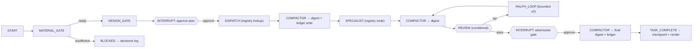

# SOLAR-Ralph v5 — System State (governor-as-graph)

> **Version note (2026-09-05):** this doc is the **v5.3 track** — governor-as-graph (LangGraph). The v5 line folds three threads: **v5.1** context-efficiency (shipped) · **v5.2** agent-consistency enforcement via platform primitives (see `docs/research/v5-agent-consistency-*.md`, `docs/work-logs/v5.2-consistency-implementation-plan.md`) · **v5.3** governor-as-graph (this doc). Sub-versions = clean commit buckets.
> **Status:** RELEASED — v5.4.0 (2026-09-18). The **HTTP runner now has full role capacity
> without a shell**: `read_file` line ranges; a write deny-list plus per-role
> `write`/`write_scope`/`write_deny`; `tools` finally gates the offered tool set; a
> repo-declared command vocabulary (`.solar/commands.json` — fixed argv, no free-text
> field) with per-role `exec_allow`; a **tool-enforced** approval gate for acting
> commands; and checkers as first-class shaped tools. Also absorbs **TD-5.4-1**: each
> role's registry `model` is now resolved. Runtime (`solar-governor/`) carries all of it;
> mandarin pilot (`solar-v5-wire`, reference only) T1–T5 PASS + epic-25 Phase A
> delivered + driver-orchestrated verify close-out APPROVED; eval battery 18/18.
> Chaining is driver-orchestrated (the self-chain entry dispatch was removed in v5.3.1).
> Full epic-25 with the detailed pipeline = still next, on `main` after installing the
> runtime.
> **Release:** v5.4.0 (2026-09-18)
> **Preceded by:** v4 (see [v4.md](v4.md))
> **Theme:** Governor-as-graph — LangGraph is the **control layer**, MCP is the **tool layer**, the host repo is the **data/context layer**. Same SOLAR pillars, real control flow.

---

## 1. What Changed from v4 (summary)

| Area          | v4.6 (textual control)                   | v5 (governor-as-graph)                                                      |
| :------------ | :--------------------------------------- | :-------------------------------------------------------------------------- |
| Runtime       | VS Code + Copilot only (prompts + hooks) | Own Python process (LangGraph); VS Code = one client of many                |
| Control       | prompt-instructed state machine          | graph nodes + conditional edges (deterministic routing)                     |
| State         | `.ai_ledger.md` (3 real sections)        | SQLite checkpoint + rendered human-view ledger                              |
| Adversarial   | post-tool-use hook + Review Auditor      | write-guard in workspace MCP server + adversarial VERIFY node (interrupt)   |
| Specialists   | `.agent.md` files (stateless subagents)  | `SPECIALISTS` registry → in-graph LLM nodes (+ optional write adapter)      |
| Compaction    | Context Summarizer subagent per dispatch | **compactor** first-class node (digest + ledger write)                      |
| Profiles      | 5 config toggles only                    | **light / full** named graph configurations over one runtime                |
| Install       | `solar-install.prompt.md` (~30 files)    | one engine, 4 fronts: `uvx`/`npx solar-governor init`, container, CI action |
| Verifiability | manual                                   | install `doctor` + operational eval (rolling L3 metrics)                    |
| Sovereignty   | n/a (local only)                         | repo-bounded by default; hub uplink = opt-in, owned repos only              |

## 2. Architecture — three layers

```
┌─ Surface (any client): VS Code (.mcp.json) · CLI `solar run` · HTTP/SSE · later Slack/WhatsApp
├─ CONTROL LAYER — LangGraph governor graph (own process)
│     gates · routing · interrupts · checkpoint · compactor · profiles
├─ TOOL LAYER — MCP servers (local, repo-scoped)
│     workspace (read/edit + write-guard) · exec · repo-index · [kb uplink = owned repos only]
└─ DATA/CONTEXT LAYER — repo-local truth
      .solar/state (checkpoint) · .ai_ledger.md (human view) · learnings · artifacts
      [optional hub uplink: digests/decisions/learnings → hub events.db — owned repos only]
```

**Guardrail:** MCP = tool protocol · LangGraph = control flow · repo = durable truth. Never rebuild the vector DB or MCP runtime inside the graph.

## 3. Governor (graph)

| Property      | Value                                                         |
| :------------ | :------------------------------------------------------------ |
| Runtime       | Python 3.12 process (own; no IDE required)                    |
| Engine        | LangGraph 1.x (pinned)                                        |
| State schema  | §4                                                            |
| Checkpointer  | SQLite (`langgraph-checkpoint-sqlite`) — durable restart-safe |
| Human-in-loop | `interrupt()` → approve/deny over any channel (stdin / HTTP)  |
| Observability | traces (`get_state_history`) + repo-local events              |
| Entry points  | CLI `solar run "<task>"` · MCP server · HTTP/SSE (later, R9)  |
| Model routing | per-node `model` config (env) — cheap→fast, deep→strong       |

## 4. State schema

Grounded on the **real** v4 ledger (3 sections). ⚠️ **Drift note:** README + v4.md claim a 5-section ledger (`Loop State`, `Materials`); the actual installed template has **3** (Objective / Work Queue / Decisions Log). v5 does not inherit the phantom sections — anything v5 needs becomes an explicit state channel.

```python
class SolarState(TypedDict):
    # --- ledger-sourced (rendered to .ai_ledger.md) ---
    objective: str
    work_queue: list[TaskRow]      # id, task, agent/role, status, stage, iteration
    decisions_log: list[str]       # append-only, UTC timestamps
    # --- graph runtime ---
    thread_id: str
    stage: str                     # current node
    intent: str                    # routed intent
    materials_status: str          # READY / INSUFFICIENT
    design_status: str             # PENDING / APPROVED / REJECTED
    digests: list[Digest]          # compactor output per stage
    verdict: str                   # APPROVED / REJECTED
    result: str
```

`TaskRow` / `Digest` are the only structured additions; the ledger render is derived from this state (checkpoint = source, ledger = render).

## 5. Node map



| Node               | Purpose                                                                                          |
| :----------------- | :----------------------------------------------------------------------------------------------- |
| MATERIAL_GATE (G1) | materials-status READY? else emit `MATERIAL_INSUFFICIENT`, pause                                 |
| DESIGN_GATE (G2)   | plan approved? `interrupt()` if `human_approval` / full profile                                  |
| DISPATCH           | registry lookup by intent → next specialist (deterministic, no bypass)                           |
| COMPACTOR          | collapse raw/intermediate + decisions → digest; append ledger                                    |
| SPECIALIST         | in-graph LLM node from registry (or a-dispatch adapter for deep writes)                          |
| REVIEW (G4)        | conditional edge: pass → adversarial / fail → Ralph loop (G3 bound)                              |
| RALPH_LOOP         | bounded re-entry (iteration ≤3)                                                                  |
| ADVERSARIAL        | `interrupt()`: non-author auditor verdict → approve/deny                                         |
| PREMISE_GATE       | debate: verify the user's premise vs ground truth before executing; mismatch → interrupt (§18.3) |
| GUIDED_HANDOFF     | hand-guide: user delivers part themselves with guide + checkpoints (§18.4)                       |
| TASK_COMPLETE      | checkpoint reset + ledger re-render (automatic)                                                  |

## 6. Specialist registry

`SPECIALISTS` = `{ role: { system, tools, next_edges, model, write?, write_scope?, write_deny?, exec_allow? } }` — the graph equivalent of `AGENTS.md` §3. Everything from `write?` on is optional and **enforced by the tool layer, not the prompt** (v5.4.0):

| Key             | Meaning                                                                                                                                 |
| :-------------- | :-------------------------------------------------------------------------------------------------------------------------------------- |
| `tools`         | tool GROUPS the role may use. **Now actually read** — without `workspace` the file tools are not offered, without `exec` `run_command` is not. Absent/empty = `["workspace"]` (the historical default). |
| `write`         | `false` = read-only: `write_file` is neither offered nor permitted. Defaults to `true`, so existing registries are unchanged.           |
| `write_scope`   | if set, writes MUST fall under one of these repo-relative prefixes.                                                                      |
| `write_deny`    | extra prefixes this role may not write. Additive only — it can never re-open the unconditional deny-list.                               |
| `exec_allow`    | names from `.solar/commands.json` this role may run. Defaults to NOTHING: exec is opt-in.                                               |

**Why the tool layer and not the prompt:** the running model overrides prose constraints, including explicit ones (measured **0/8** on a read-only instruction, and `you MUST` ignored **8/8**). Capability is the containment — a tool that is never offered cannot be argued into use. The **unconditional** write deny-list is `.solar/`, `.git/`, `.github/`, `.vscode/` plus agent/CI-defining files (`package.json`, `pyproject.toml`, `Dockerfile`, `.mcp.json`, …), matched case-insensitively on any path segment at any depth.

- **Swap** a specialist = edit one registry entry (data, not a file + installer).
- **Playbook** = a named edge sequence over the registry (v4 §5 Playbook Index becomes a routing config).
- v4's "specialists are stateless, digest-fed" invariant is preserved by the compactor (channel isolation).
- **a-optional write adapter:** deep code-writing tasks may dispatch the existing `.agent.md` subagents via an MCP agent-dispatch tool (preserves hook-guarded writes); lightweight steps stay in-graph.
- **Role spec adds behavior (§18.3/18.4):** each specialist's spec carries (a) **premise-verify** — challenge the user's framing against ground truth (repo/spec) before executing; (b) **hand-guide detection** — recognize when the user should deliver part themselves and route to GUIDED_HANDOFF.

## 7. Compactor (first-class node)

- Inputs: raw session/intermediate output, `user redirect` changes, decisions log entries.
- Outputs: compact `digest` (the ONLY state the next specialist receives) + ledger append (surfaced memory).
- Token-cost control: digest target ≤ ~40% of raw (measured in EVAL 6).
- Makes v4's manual "context roll-up after 3 dispatches" obsolete.

## 8. Profiles — light / full

Named graph configurations over ONE registry + ONE runtime (the 5 `solar.config.json` toggles become profile knobs).

| Dimension           | 🪶 Light (fast-moving repos, e.g. mandarin) | 🛡 Full (spec-driven)                |
| :------------------ | :------------------------------------------ | :----------------------------------- |
| Nodes               | `dispatch → review → done` (4–5 nodes)      | full map (§5)                        |
| Gates               | none (or design-only)                       | G1–G4 enforced                       |
| Adversarial         | off (or fast single-pass)                   | domain-matched auditor               |
| Human approval      | off / on-demand                             | on (design + adversarial interrupts) |
| Ledger              | checkpoint only                             | full + human view                    |
| Compactor           | off                                         | mandatory                            |
| Hooks / write-guard | deny-list floor + role policy (§6)           | workspace MCP guard                  |
| Model               | single fast model, per-role `model` if set   | tier/model per node                  |

**Deep trade (see §13.15):** light sacrifices independent verification, design gate, effort steering, restart ceremony — for speed, low tokens, no interrupt friction. What always survives: the parts that encode _judgement_ (design approval, adversarial, project playbook gates).

## 9. Install & cloud-ready (one engine, 4 fronts)

| Front      | Command / artifact                                                                                                                        | Notes                                                                        |
| :--------- | :---------------------------------------------------------------------------------------------------------------------------------------- | :--------------------------------------------------------------------------- |
| Engine CLI | `pip install ./solar-governor` · `solar-governor init --profile light\|full` · `solar-governor run "<task>"` · `serve` / `bench` / `eval` | **shipped** — writes `.solar/config.json` + `registry.json` (Python package) |
| npm shim   | `npx solar-governor init` (planned)                                                                                                       | thin wrapper for JS/TS repos                                                 |
| Container  | `ghcr.io/solar-ralph/governor` (planned)                                                                                                  | headless cloud runs; state → volume/GCS/S3                                   |
| CI action  | `solar-ralph/governor-action` (planned)                                                                                                   | install + run in CI, zero local setup                                        |

**Cloud-ready (planned):** headless (`solar run` in bare terminal/CI/container) · non-interactive (`--ci`/`--yes`, env `SOLAR_PROFILE`, `SOLAR_APPROVAL=off`) · durable state (volume/object store) · remote later (HTTP/SSE gateway). Shipped today: the CLI + `serve` HTTP API on a local repo.

## 10. Verifiability — install + operation

- **Install (`init --verify` / `solar-governor doctor`):** graph compiles · registry loads · MCP servers connect (workspace/exec/repo-index) · checkpoint SQLite writable · model endpoints reachable · uplink config valid · **smoke task runs end-to-end on THIS repo** (material gate → dispatch → review → TASK_COMPLETE). Output = JSON health report (PASS/WARN/FAIL); non-interactive in CI.
- **Operational:** per-run telemetry (checkpoint written, ledger rendered, traces) → repo-local events · rolling eval metrics (completion %, first-pass APPROVED %, rework count, tokens/task) · periodic `doctor` (MCP alive, checkpointer durable, model fallback) · read-only guard denies writes outside the repo **and to a protected in-repo set** (§6). An **acting** command (`kind: act`) does not run at all when `human_approval` is set — it writes `.solar/approvals/<id>.md` and stops, so the model cannot proceed until a human writes `allow` or `deny: <reason>` (§6/Part D). `kind: check` output is **shaped**: a passing check collapses to one line, a failing one keeps its failures plus the final summary and states how many lines it suppressed.

## 11. Data sovereignty

1. **Local-first, always** — checkpoint `.solar/state/`, ledger, learnings, artifacts all in the host repo.
2. **Hub = optional uplink, opt-in** — `uplink: none | hub:<url>`, default `none`; only repos we own set it; repo stays source of truth, hub is pure consumer.
3. **Graceful degradation** — no hub → KB node skipped, graph still completes.
4. **Hub reach = workspace mount access only** (structural, not just policy).
5. The harness is **fully functional standalone** on any repo (incl. third-party); it never depends on the hub.

## 12. What stays / what changes

**Stays (public API preserved):** `solar-install.prompt.md` (as glue/fallback) · `solar.config.json` (flags → profile) · `AGENTS.md` (registry source → `SPECIALISTS`) · `#solar.prompt.md` (zero-runtime fallback) · `solar.instructions.md` (communication discipline) · `post-tool-use` write-guard (→ workspace MCP server).

**Changes:** `.ai_ledger.md` → checkpoint + human view · `verification-artifacts/` tree → one verdict + traces · `effort_preamble_lookup` (TD-4-\*) → model routing · `stop` hook → terminal node · Context Summarizer subagent → compactor node · `solar-registry-update` prompt → registry data edits.

## 13. v4→v5 migration

1. Install the governor runtime (`pip install ./solar-governor`, then `solar-governor init --profile <light|full>`).
2. Migrate `AGENTS.md` §3 registry → `SPECIALISTS` registry (mechanized).
3. Migrate ledger → checkpoint + human-view renderer (state schema §4).
4. Migrate G1–G4 gates → graph nodes (§5).
5. Migrate write-guard hook → workspace MCP server (server-side policy).
6. Keep `#solar.prompt.md` as the zero-runtime fallback.
7. Validate: install `doctor` + golden-task run (§13.10 L3).
8. **Parallel-run** v4 harness + v5 graph on the same task suite → compare (completion %, first-pass APPROVED %, rework, tokens/task). Evidence feeds the B2 decision gate.

## 14. IDE-agnostic

L0: `.agent.md`/askQuestions → registry nodes + non-IDE interrupt channel. L1: tools behind MCP (workspace/exec/repo-index). L2: per-node model config (env). L3: same graph from any surface (VS Code `.mcp.json`, CLI, HTTP/SSE). What stays VS Code-bound: the diff/approve write UX — VS Code becomes one client of many; Copilot becomes one model/tool backend.

## 15. Known decisions / open questions

1. **Specialist-node shape:** b-primary (registry + compactor + conditional routing) + a-optional write adapter — validated in B2 EVAL 5/6.
2. **Checkpointer:** SQLite required (MemorySaver would regress restart-safety).
3. **Compactor threshold:** digest ≤ ~40% raw (measure in EVAL 6).
4. **Profiles:** `light` / `full` initial; `balanced` optional.
5. **Uplink:** default `none`; owned satellites opt in per repo.
6. **Observability:** LangSmith vs `get_state_history` + local events (defer).
7. **Behavior defaults (v5.md §18):** PREMISE_GATE on/off per profile, hand-guide routing signals, capture-layer toggles — validate during the mandarin pilot (B3).

## 16. Reference / grounding

- Hub plan: `_wip/master-repo-restructure.md` §13.9 (feasibility), §13.10 (test/eval), §13.11 (IDE-agnostic), §13.12 (install), §13.13–13.15 (profiles + deep trade)
- Prototype + 6 evals: `experiments/governor-graph/` (B2)
- v4 internals + drift findings: `docs/versions/v4.md`, `template/.github/AGENTS.md`, `template/.github/prompts/solar.prompt.md`, `TODOs.md`

## 17. Decision — B2 gate (2026-08-31)

**Evidence — all 6 evals PASS (`experiments/governor-graph/eval.md`):**

| Eval                         | Result                                                    |
| ---------------------------- | --------------------------------------------------------- |
| EVAL 3 deterministic routing | 20/20 stable routes (kills TD-4-1 bypass)                 |
| EVAL 1 HITL interrupt        | approve→complete, deny→rework→re-pause→complete           |
| EVAL 2 SQLite checkpoint     | resume after session loss in a NEW process                |
| EVAL 4 streaming             | node outputs incremental, SSE-framed (R9 gateway)         |
| EVAL 6 compactor             | 120→44 tokens (37%); consumer sees only digest            |
| EVAL 5 hub KB MCP            | node→hub tool call + graceful degradation when hub absent |

**Verdict: ✅ ADOPT v5 on graph — proceed to full migration.**

- **Master-structure test passed:** MCP (tool layer) + hub (data layer) from Part A host a LangGraph control layer.
- **Timeline (actual):** (a) runtime shipped — registry + light/full profiles + CLI/HTTP (`pip install ./solar-governor`); (b) **pilot: v5 LIGHT on mandarin** (`solar-v5-wire`, reference only) — T1–T5 PASS + epic-25 Phase A + verify close-out APPROVED; self-chain falsified → driver-orchestrated (v5.3.1); (c) **v5.4.0** — HTTP runner capacity without a shell (Parts A–E: line ranges, write policy, command vocabulary, approval gate, shaped checkers) + per-node model routing (TD-5.4-1); (d) **next:** install the runtime on mandarin `main` and run the real epic-25 with the full pipeline; (e) later: hub router-as-graph (R9) + remaining fronts (npm/container/CI, SSE).
- **Carried guardrails (feasibility §13.9.2):** specialist shape **b-primary / a-optional**; SQLite checkpoint mandatory; compactor ~40% token target; sovereignty repo-bounded, hub uplink opt-in (§13.14).
- **Follow-on (post-migration):** adopt v5 to run ON the master repo itself.

## 18. Behavior principles + capture model (2026-09-04)

Design notes from the master-repo review + pre-pilot considerations.

### 18.1 Concerns already solved by design (instruction drift + orchestrator scope)

- **Instruction drift ("lost in the middle"):** the orchestrator is CODE (nodes/edges), not a long-lived prompt model — there is no governor system prompt to forget. Specialist LLM nodes get a fresh, short system prompt + only the compactor digest → drift is bounded per-node, never accumulated globally.
- **Orchestrator reasoning outside scope:** routing = conditional edges (pure functions); the only judgment gates are human interrupts. The "LLM orchestrator makes calls it shouldn't" failure is removed by construction.

### 18.2 Explore/debug mode (non-spec work)

- Debugging/exploratory work is **agent-mode**, not workflow. Add an **EXPLORE/debug subgraph** (LLM-directed, loose gates) reachable from routing when intent = debug/explore/investigate.
- Spec work → workflow path (deterministic); debugging → explore path (flexible). Bounces between them are cheap graph edges (~0 tokens) → "more bounce → more drift" does not recur.
- Profile note: light defaults toward explore; full keeps a **spec-lock** requiring an explicit human override to leave the spec path.

### 18.3 Debate gate — verify the user's premise before obeying

- **Principle:** the specialist's first instinct is to VERIFY against the user's actual input + ground truth (repo/spec/reality). Most AI-agent failures come from trusting/over-obeying a wrong or ambiguous user framing.
- **Node:** PREMISE_GATE — parse the request into premises; check each against retrievable ground truth (codebase search, docs, state via MCP tools); if a premise fails/ambiguous → `interrupt()` with a **debate** (present the discrepancy, let the human resolve direction) BEFORE any work.
- Full profile: PREMISE_GATE always on (interrupt on mismatch). Light profile: quick premise check; skip on explicit "just do X."
- Personality fit: Cd (Skeptic) — argues with the request before committing; evidence over compliance.

### 18.4 Hand-guide mode — the user may need to deliver part of the task

- **Principle:** the harness is self-aware that some tasks are best done BY the human: learning a new stack, building intuition/ownership, judgment only the user can make, or steps only they have access to. **Anti-vibe-coding:** equip the user to do it with understanding rather than always doing it for them.
- **Node:** GUIDED_HANDOFF. Routing detects intent signals ("teach me / how do I / should I / I'll write it", new-stack user needing confidence, dev wanting hands-on) → subgraph that produces: decision rationale, step-by-step guide, verification checkpoints; leaves execution to the user (optionally AI reviews afterward).
- Serves two users: (a) unsure about a new stack → needs to be sure decisions are right (guide + verify); (b) a dev who must write code to truly understand it → guide, don't replace.
- Wiring: intent detection in classify/route; role spec gains hand-guide-vs-do-it; profiles toggle how eager the graph is to hand off.

### 18.5 Four-layer capture model — what the graph records

| Layer          | Captures                                       | Source                     | Feeds                                   |
| -------------- | ---------------------------------------------- | -------------------------- | --------------------------------------- |
| **Checkpoint** | full state per super-step                      | SQLite                     | replay / resume / audit                 |
| **Trace**      | raw process (prompts, outputs, tool calls)     | LangSmith / OpenAI tracing | failure analysis, self-improve (opt-in) |
| **Run-card**   | structured metrics (tokens, duration, verdict) | per-run JSON (§14.7.3)     | evaluation                              |
| **Digest**     | compacted memory/decisions                     | compactor → ledger / hub   | self-improve, contribute to master      |

- State IS fully captured (checkpoint). Raw model reasoning lives in **trace** (selective, not auto-logged — secrets + cost).
- Sovereignty (§13.14): only owned repos uplink, and only the curated record (digest/decisions/run-cards), never raw transcripts.
- The hub already has the sinks: `data/events.db` + `/remember` + repo index → v5 nodes write into them when connected (owned-repo uplink).

## 19. Concept alignment — canonical concept → v5.3 graph (2026-09-05)

The governor-as-graph is the **formalization** of the canonical concept (`docs/solar-ralph-concept.md`): the concept's "pure event-driven orchestrator that reads the ledger and fires nodes" was a hand-written state machine — v5.3 makes it code (LangGraph). All 8 concept invariants survive:

| #   | Concept invariant                                         | v5.3 graph equivalent                                                   |
| --- | --------------------------------------------------------- | ----------------------------------------------------------------------- |
| 1   | Orchestrator never forks; runs inline; owns all gates     | the graph (code) owns all gate nodes                                    |
| 2   | Specialists never communicate directly                    | nodes communicate only via **state channels** + compactor digest        |
| 3   | Adversarial = non-author, domain-matched                  | review/adversarial nodes (non-author, role-matched)                     |
| 4   | Ralph loop needs declared exit criteria                   | bounded rework ≤3 + explicit exit edges                                 |
| 5   | `TASK_COMPLETE` gated by adversarial                      | review gate → complete                                                  |
| 6   | Ledger is sparse (Objective / Work Queue / Decisions Log) | matches the real 3-section ledger; checkpoint = source, ledger = render |
| 7   | Material gate before every dispatch                       | `material_gate` node                                                    |
| 8   | `BLOCKED:` appended to Decisions Log                      | BLOCKED edge → decisions_log                                            |

**Mechanism shifts (invariants preserved, medium changed):**

- Orchestrator: prompt-instructed agent → **deterministic graph** (no drift, no scope creep).
- Handoff: `verification-artifacts/` files → **state channels + compactor digest** (compactor = context-summarizer + artifact writer merged).
- Context: Context-Summarizer subagent per dispatch → **compactor node** (channel isolation).
- Tools: IDE tools + `.cjs` hooks → **MCP servers** (provider-agnostic).
- `.github/` (template/): kept as the v4/v5.x agent-harness form, used for IDE-native Copilot subagent dispatch (shape-a write adapter).
